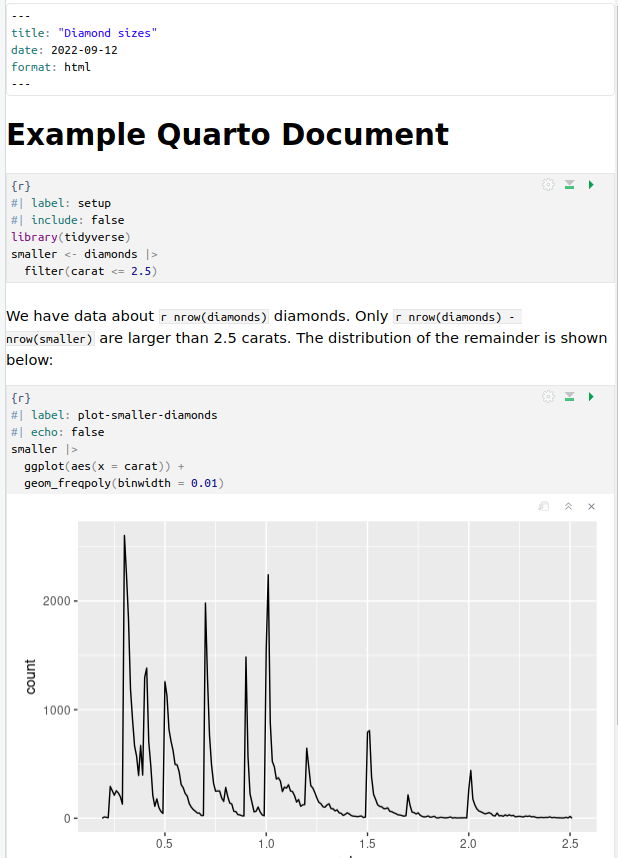
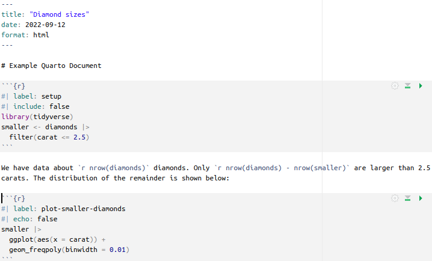
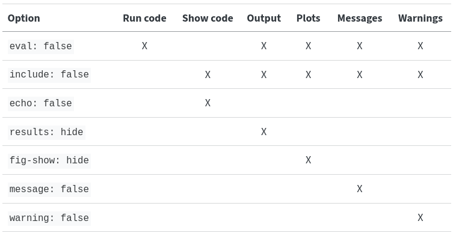

<style>
.reveal {
  font-size: 160%;
}
</style>

```{r}
#| echo: false
#| include: false
library(knitr)
library(ggplot2)
```

## Why Reproducible Research?

- Traditional workflow: code in one place, results in another
- Hard to trace where a figure or number came from
- **Reproducible documents** combine code, output, and narrative in one file
- Re-running the document regenerates all results automatically
- Essential for science, reporting, and collaboration

## R Markdown and Quarto

- **R Markdown** (`.Rmd`) — the original literate programming format for R
- **Quarto** (`.qmd`) — the next generation, language-agnostic successor
  - Supports R, Python, Julia, and Observable JS
  - Same syntax as R Markdown, with improvements
  - We use **Quarto** in this course

## Document Structure

A Quarto document has three parts:

1. **YAML header** — metadata and output options
2. **Markdown text** — narrative, explanations, formatted prose
3. **Code chunks** — executable R (or other language) code

```
---
title: "My Report"
format: html
---

Some text here.

` ``{r}
x <- 1:10
mean(x)
` ``
```

## YAML Header

- Surrounded by `---` at the top of the file
- Controls document title, author, date, output format

```yaml
---
title: "Assembly Report"
author: "Jane Doe"
date: today
format:
  html:
    toc: true
    toc-location: left
    self-contained: true
---
```

Common formats: `html`, `pdf`, `docx`, `revealjs` (slides)

## Markdown Basics

```markdown
# Heading 1
## Heading 2

Plain paragraph text.

**bold**, *italic*, `inline code`

- bullet item
- another item

1. numbered
2. list

[link text](https://quarto.org)
```

## RStudio Editors

Two editing modes — switch with the button top-right:

- **Visual editor** — WYSIWYG, like Word

{width=80% fig-align="center"}

- **Source (plain text) editor** — raw Markdown

{width=80% fig-align="center"}

## Code Chunks

Code chunks are surrounded by triple backticks with `{r}`:

```
` ``{r}
#| label: my-chunk
#| echo: true
x <- 1:10
mean(x)
` ``
```

Each chunk is executed in order when the document is rendered.

## Chunk Options

Options go inside the chunk, prefixed with `#|`:

{width=70% fig-align="center"}

(source: [r4ds](https://r4ds.hadley.nz/quarto.html))

## Most Useful Chunk Options

| Option | Effect |
|---|---|
| `echo: false` | hide code, show output |
| `eval: false` | show code, don't run it |
| `include: false` | run silently (no code, no output) |
| `message: false` | suppress package load messages |
| `warning: false` | suppress warnings |
| `fig-cap: "..."` | add a figure caption |

## Example: `include: false` — Load Libraries Silently

The chunk below runs but produces **no output and no code** in the document:

```
` ``{r}
#| include: false
library(ggplot2)
` ``
```

Ideal for loading packages at the top of a document — nothing appears on the slide/page.

## Example: `echo: true` — Show Code and Output

```
` ``{r}
#| echo: true
x <- 1:10
y <- x^2
print(y)
` ``
```

Both the code and its output are shown:

```{r}
#| echo: true
x <- 1:10
y <- x^2
print(y)
```

## Example: `echo: false` — Hide Code, Show Plot

```
` ``{r}
#| echo: false
#| fig-cap: "Fig. 1 Iris sepal dimensions by species"
ggplot(iris, aes(x = Sepal.Length, y = Sepal.Width, color = Species)) +
  geom_point()
` ``
```

Only the plot appears — code is hidden:

```{r}
#| echo: false
#| fig-cap: "**Fig. 1** Iris sepal dimensions by species"
ggplot(iris, aes(x = Sepal.Length, y = Sepal.Width, color = Species)) +
  geom_point() +
  labs(title = "Iris Sepal Length vs Width")
```

## Side-by-Side Figures

Use `layout-ncol` to place plots side by side:

```
` ``{r}
#| layout-ncol: 2
plot(1:10, main = "Plot 1")
hist(rnorm(500), main = "Plot 2", col = "steelblue")
` ``
```

```{r}
#| layout-ncol: 2
#| echo: false
plot(1:10, main = "Plot 1")
hist(rnorm(500), main = "Plot 2", col = "steelblue")
```

## Inline Code

Embed R results directly in prose using `` `r ` ``:

```{r}
#| include: true
#| eval: false
#| echo: true
# The dataset has `r nrow(iris)` rows and `r ncol(iris)` columns.
# The mean sepal length is `r round(mean(iris$Sepal.Length), 2)` cm.
```

Renders as:

> The dataset has 150 rows and 5 columns.
> The mean sepal length is 5.84 cm.

## Printing Tables with `kable`

Raw data frame print vs. `knitr::kable()`:

```{r}
#| echo: true
iris[1:3, ]
```

## Printing Tables with `kable` (cont'd)

```{r}
#| echo: true
knitr::kable(iris[1:3, ], caption = "Table 1: First rows of the iris dataset")
```

## Formatting `kable` Tables

```{r}
#| echo: true
df <- data.frame(
  Value = c(1234.5, 98765.4, 1234567.9),
  Rate  = c(0.123,  0.988,   0.543)
)
knitr::kable(df, digits = 2,
             format.args = list(big.mark = ","),
             caption = "Formatted numeric columns")
```

## Caching Long Computations

- By default every chunk re-runs on each render
- Use `cache: true` to save results and skip re-running unless the chunk changes

```
` ``{r}
#| cache: true
Sys.sleep(10)        # simulate a slow computation
result <- run_model()
result
` ``
```

Global caching via YAML — applies to all chunks:

```yaml
execute:
  cache: true
```

Quarto saves results to `_cache/` and reuses them on subsequent renders.

## Rendering from the Command Line

You don't need RStudio — render any `.qmd` file with:

```bash
quarto render 08_RMarkdown_CLI/08_RMarkdown.qmd
```

Or specify the output format:

```bash
quarto render report.qmd --to pdf
quarto render report.qmd --to html
```

Useful for automation and reproducible pipelines.

## Summary

- Quarto documents combine **YAML**, **Markdown**, and **R chunks**
- Chunk options control visibility (`echo`, `eval`, `include`) and appearance
- Inline code embeds live results in prose
- `knitr::kable()` formats tables neatly
- `cache: true` speeds up slow documents
- Render from the command line with `quarto render`

> 📝 **Task 1** — Open `08_RMarkdown.qmd` in RStudio and render it. Inspect each chunk and its output. Try changing one chunk option and re-render.

> 📝 **Task 2** — Add a new section with an inline code sentence reporting the number of rows in the `iris` dataset, and a `kable`-formatted table of the first 5 rows.
