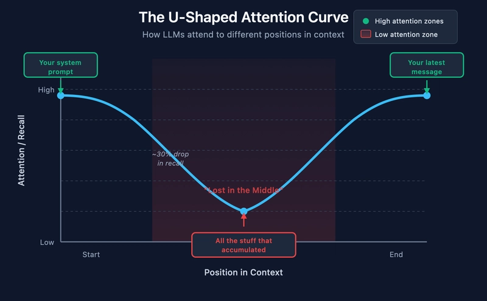
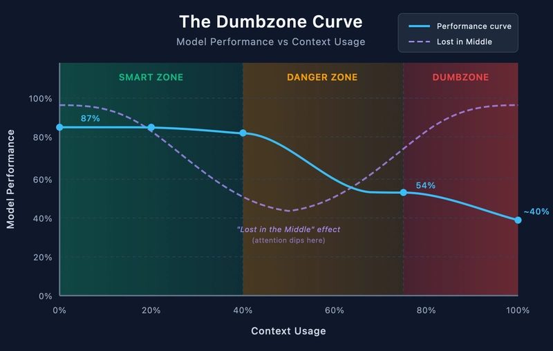

## What just changed

::: {.columns}
::: {.column width="50%"}
**Classic loop**

1. Think
2. Type code
3. Run
4. Debug
5. Repeat
:::
::: {.column width="50%"}

**Agent-assisted loop**

1. **Think**
2. **Specify** what you want
3. **Review** what you got
4. **Correct** the spec or the code
5. **Commit** when it works
:::
:::

. . .

The bottleneck moved from *typing code* to *specifying intent and reviewing output*.


## The trust problem


The agent is **fast** and **confident**. Its confidence is **uncorrelated** with correctness.

- Agent invents a function that doesn't exist
- Agent silently changes a default parameter you didn't ask about.
- Agent "fixes" a test by deleting the failing assertion.
- When R says `Error`, it means error. When the agent says "Done!", it might mean anything.

. . .

Why use it? The speed gain is real and large, *if* you build the discipline to verify.


## Anatomy of a small project

```
my-project/
├── README.md           ← what is this, how to run it
├── PLAN.md             ← what are we trying to do
├── CLAUDE.md           ← rules for the agent
├── AGENT.md            ← rules for the agent
├── .gitignore          ← what NOT to track
├── data/
│   ├── raw/            ← inputs, read-only
│   └── processed/      ← derived, can be regenerated
├── scripts/                  ← functions and scripts
├── tests/              ← checks
├── results/            ← figures, tables
├── reports/            ← the story

```
 There is no `One True Layout`. There are many valid project structures it depents on the project you're working on.


## Raw data

::: {.callout-important}
## Rule
Inputs in `data/raw/` are **read-only**. Never overwrite. Never edit in place.
:::

. . .

- `data/raw/patients.csv` — what arrived from the source
- `data/processed/patients_clean.tsv` — what your script produced

. . .

- If your processing code has a bug and you've edited the raw file, you cannot recover.
- `chmod -w data/raw/*` prevents accidental overwrites.

## README

- **What is this about?**
- **How do I install it/run it?**

. . .

Three audiences:

- **Future you**, six months from now, who has forgotten everything
- **A collaborator/other user** cloning the repo for the first time
- **The agent**, which reads it on every session to understand the project


## Version control in 90 seconds

```bash
git init                          # once, at the start
git add .                         # stage current state
git commit -m "describe change"   # snapshot
```

. . .

**Why it matters with an agent:**

- The agent will sometimes break things you didn't ask it to touch.
- A commit is a state you can return to. `git diff` shows you what changed.
- Commit *before* every agent session. Commit *after* every working step.


## Working with an agent

## Vibe coding vs. specification-driven{.smaller}

::: {.columns}
::: {.column width="50%"}
**Vibe coding**

"Make me a script that downloads the data and plots something nice."

- Fast
- No upfront thinking
- Fine for throwaways and exploration
:::
::: {.column width="50%"}
**Spec-driven**

"Read `data/raw/x.csv`. Filter to rows where `treated == TRUE`. Compute mean of column `y` per group. Output a 2-column TSV: `group`, `mean_y`."

- Slower to start
- Forces you to know what you want
- Reproducible, reviewable
:::
:::

. . .

It's a **spectrum**, not a binary
choice. Match the rigor to the stakes.


## Anatomy of a plan

A one-page plan, written *before* any code:

```markdown
# Plan

## Question
Does proteome amino acid composition correlate with optimal
growth temperature in prokaryotes?

## Inputs
- TEMPURA database (CSV, ~1 MB) — taxon ID, optimal T, lifestyle
- UniProt reference proteomes (FASTA, ~30 organisms × 2 MB)

## Outputs
- `results/composition.tsv` — per-organism AA fractions
- `results/figure_1.png` — IVYWREL fraction vs. T_opt
- `report.html` — Quarto report

## Steps
1. Download and parse TEMPURA
2. Select balanced organism set (psychro/meso/thermo/hyperthermo)
3. Fetch reference proteomes from UniProt
4. Compute AA composition per proteome
5. Fit linear model, plot, write report

## Success criteria
- All organisms have both T_opt and a proteome
- The figure shows a visible trend or its absence
- The report runs end-to-end with one command
```

## Anatomy of plan

- The plan is also what you give the agent at the start of the project
- Or create with a agent at the beginning of the project
- The plan can change during the project, edits are deliberate, iterative


## Decompose the task to small steps

::: {.callout-warning}
## What usually fails
"Build the whole pipeline."
:::

::: {.callout-tip}
## What works better
"Step 1: write a function that reads the TEMPURA CSV and returns a tibble. Show me the code. I'll review it before we move on."
:::

. . .

Why small steps win:

- You can **review** 30 lines. You cannot review 300.
- A bug in step 1 propagates silently into steps 2–5.
- When something breaks, you know where.


## Rules files{.smaller}

`CLAUDE.md` (or `AGENTS.md`) — the agent reads this on every session.

```markdown
# Project rules

## Code style
- Use the tidyverse for data wrangling. Prefer `dplyr` over base R.
- All functions go in `R/`. Scripts go in `scripts/`.
- Each script must be runnable standalone via `Rscript`.

## Data
- `data/raw/` is read-only. Never write to it.
- Outputs go to `data/processed/` or `results/`.

## Workflow
- Before writing code, restate what you understood from my request.
- Make small, focused commits. Don't refactor unrelated code.
- If you need a package not installed, tell me — don't assume.
```

. . .

Persistent conventions live here. Per-task instructions go in the prompt.

## Rules files{.smaller}

What goes in `CLAUDE.md` (`AGENTS.md`:)

- Conventions you don't want to repeat in every prompt.
- Project-specific gotchas ("the column `id` is a string with leading zeros, never coerce").
- Workflow rules ("explain before coding," "tests before implementation").
- Where things go (paths, naming).

What does *not* go in `CLAUDE.md`:

- The current task. That's the prompt.
- The plan.
- Documentation for humans. That's the README.


## Tests, lite version{.smaller}

The principle: write a check **before** the code that's supposed to satisfy it.

```r
# tests/test_composition.R
library(testthat)
source("R/compute_composition.R")

test_that("composition returns one row per amino acid", {
  fasta <- readAAStringSet("tests/fixtures/tiny.fasta")
  result <- compute_composition(fasta)
  expect_equal(nrow(result), 20)
  expect_true(all(c("aa", "fraction") %in% colnames(result)))
  expect_equal(sum(result$fraction), 1, tolerance = 1e-6)
})
```

. . .

- A test tells you the difference between **"the code ran"** and **"the code is correct."**
- TDD - `test driven development`

## Reviewing what the agent produced{.smaller}

What to actually look at:

- Does it match the spec? *Compare the diff to the plan.*
- Did it handle the edge case I mentioned?
- Did it silently change something I didn't ask about?
- Did it invent a function or package?
- Are the comments describing what the code *does*, or what I *asked for*? (These can differ.)

. . .

::: {.callout-note}
## Hallucinated APIs are real
Agents will confidently call `tidyr::pivot_long()` (it's `pivot_longer`). They will import packages that don't exist. Run the code; don't trust it on sight.
:::


## When to stop and replan{.smaller}

The sunk-cost trap:

> "It's almost working. One more fix."

. . .

Three rounds of "fix this" and still broken? **The spec is wrong, not the code.**
. . .

What to do:

- Reread your plan. Is the question well-posed?
- Rewrite the relevant section
- Start over with a fresh agent session
- When you have invested an hour of prompting, you can be hesitant to throw it away. But the agent context is now polluted, and it may be better to start fresh.

## When to stop and replan{.smaller}

How to recognize the moment:

- Same bug returning in different forms.
- Each fix introduces a new problem.
- You're starting prompts with "no, what I actually meant…"
- The agent is asking clarifying questions you don't know how to answer.

Each of these is a signal that the *understanding* is broken, not the code. Patching code can't fix broken understanding.

## Attention curve



## Dumb zone


## "If the agent writes the code, why learn R?"{.smaller}

Because when the agent gives you 50 lines of code, you have to answer:

- Does this do what I asked?
- Does it do anything else I didn't ask?
- Will it still work next month, on different data, with one more sample?
- Why did it choose this approach over the obvious alternative?

. . .

**You can only answer those questions if you can read the code.**


## Using agent{.smaller}

::: {.columns}
::: {.column width="50%"}
**What the agent does for you**

- Types the boilerplate
- Remembers the syntax
- Suggests packages and functions
- Writes the first draft
- Catches simple typos
:::
::: {.column width="50%"}
**What you still have to do**

- Decide what the analysis *is*
- Choose the right method
- Recognize a wrong answer
- Spot subtle bugs
- Judge whether a result makes sense
:::
:::

## The R coding skill{.smaller}

If you know R well, you can:

- Spot when the agent picked an inefficient or fragile approach
- Recognize a hallucinated function before running it
- Write a *better* prompt because they know what to ask for
- Understand the failure when something breaks
- Tell the agent "no, do it this way instead" — and explain why

- **The agent amplifies your skills**
