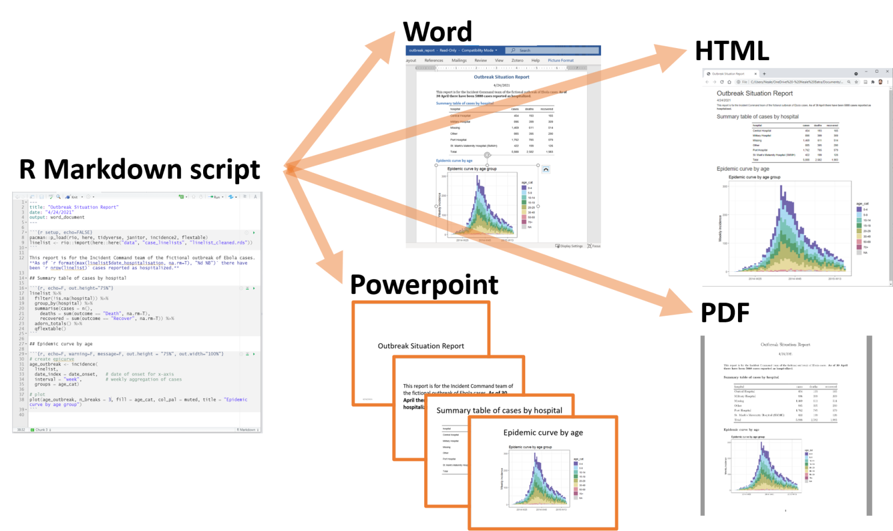

## Why R?

- Powerful, open-source tool for data analysis and visualization
- Widely used in research, reproducibility, and automation

Course Goals:

- Build a solid foundation in R programming
- Bridge the gap between raw data and meaningful biological insights

## Rich Ecosystem of Packages

- CRAN: Comprehensive R Archive Network
- Bioconductor: Tools for bioinformatics
- GitHub: User-contributed packages

Example packages:

- `dplyr` for data manipulation
- `Biostrings` for sequence analysis
- `GenomicRanges` for genomic intervals
- `DESeq2` for differential expression analysis

## Reporting in R
::: {style="font-size: 0.8em"}
- Combine text, code, and output in a single document
- R Markdown can be rendered to HTML, PDF, Word, and more
- R Markdown is the basis for this presentation!
:::
{width="80%"}


## Documentation
- Comprehensive documentation for all functions
- Vignettes provide detailed examples
- Use `?function_name` to access help
- Use `example(function_name)` to see examples
- Use `vignette("package_name")` to access package vignettes


## Biostrings
```{r}
#| echo: true
#| include: true
library(Biostrings)
seq1 <- DNAString("ACGTACTTGCGTCGTCGTACG")
seq2 <- DNAString("ACGTAGGTCGTCGTCGTACG")
# create a pairwise alignment
alignment <- pairwiseAlignment(seq1, seq2)
print(alignment)
# search for a pattern in a sequence
matchPattern("GTC", seq1)
```
## GenomicRanges

```{r}
#| echo: true
#| include: true
library(GenomicRanges)
gr <- GRanges(
    seqnames = Rle(c("chr1", "chr2", "chr1", "chr3"), c(1, 3, 2, 4)),
    ranges = IRanges(101:110, end = 111:120, names = head(letters, 10)),
    strand = Rle(strand(c("-", "+", "*", "+", "-")), c(1, 2, 2, 3, 2)),
    score = 1:10,
    GC = seq(1, 0, length=10))
gr

```
## Visualizations in R
```{r}
#| echo: true
#| include: true
library(ggplot2)
data(iris)
ggplot(iris, aes(x = Sepal.Length, y = Sepal.Width, color = Species)) +
  geom_point(size = 3)
```
## Visualizations in R
```{r}
#| echo: true
#| include: true
library(ggplot2)
library(ggridges)
ggplot(diamonds, aes(x = price, y = cut, fill = cut)) +
  geom_density_ridges() +
  theme_ridges() +
  theme(legend.position = "none")
```
## Visualizations in R
```{r}
#| echo: true
#| include: true
# heatmap
data(mtcars)
dat <- as.matrix(mtcars)
heatmap(dat, scale = "column", col = cm.colors(256))
```
## Visualizations in R
### Genomic data:
```{r}
#| echo: false
#| include: true
library(trackViewer)
features <- GRanges("chr1", IRanges(c(1, 501, 1001),
                                    width=c(120, 400, 405),
                                    names=paste0("block", 1:3)),
                    fill = c("#FF8833", "#51C6E6", "#DFA32D"),
                    height = c(0.02, 0.05, 0.08))
SNP <- c(10, 100, 105, 108, 400, 410, 420, 600, 700, 805, 840, 1400, 1402)
sample.gr <- GRanges("chr1", IRanges(SNP, width=1, names=paste0("snp", SNP)),
                     color = sample.int(6, length(SNP), replace=TRUE),
                     score = sample.int(5, length(SNP), replace = TRUE))
lolliplot(sample.gr, features)
```
## Interactive graphics

```{r}
#| echo: false
#| include: true
library(plotly)
mtcars$am[which(mtcars$am == 0)] <- 'Automatic'
mtcars$am[which(mtcars$am == 1)] <- 'Manual'
mtcars$am <- as.factor(mtcars$am)

fig <- plot_ly(mtcars, x = ~wt, y = ~hp, z = ~qsec, color = ~am, colors = c('#BF382A', '#0C4B8E'))
fig <- fig %>% add_markers()
fig <- fig %>% layout(scene = list(xaxis = list(title = 'Weight'),
                     yaxis = list(title = 'Gross horsepower'),
                     zaxis = list(title = '1/4 mile time')))

fig
```
## Basic R Syntax

- Comments: `#`
- Assignment: `<-` or `=` (preferred is `<-`)

```{r}
#| echo: true
#| include: true
# this is a comment
x <- 5
```
## Basic R Syntax
- Data types: numeric, character, logical
```{r}
#| echo: true
#| include: true
x <- 5
y <- "hello"
z <- TRUE
```
## Basic R Syntax
- Vectors: `c()`
- Matrices: `matrix()`
```{r}
#| echo: true
#| include: true
x <- c(1, 2, 3)
print(x)
y <- matrix(1:9, nrow = 3)
print(y)
```
## Basic R Syntax

- Data frames: `data.frame()`
```{r}
#| echo: true
#| include: true
print(head(iris))

```
## Basic R Syntax

- Lists: `list()`

```{r}
#| echo: true
#| include: true
x <- list(1, "hello", TRUE)
print(x)
```
## Basic R Syntax
- Functions: `function()`, Calling functions: `function_name()`
- Arguments: `function_name(arg1 = value1, arg2 = value2)`
```{r}
#| echo: true
#| include: true
x <- mean(c(1, 2, 3))
print(x)
y <- t.test(x = c(1, 2, 3), y = c(4, 5, 6))
print(y)
```
## Basic R Syntax
- Control structures: `if`, `else`, `for`, `while`
- Packages: `library()`, `install.packages()`
- Help: `?`, `example()`, `vignette()`


